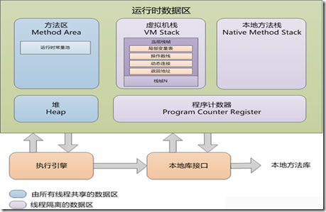

#### 前言

作为一个 Android 开发者，如果不了解 GC 机制（Garbage Collection，垃圾回收）的原理，就可能会编写出引发内存泄漏的代码，甚至出现 OOM 问题，所以只有理解了 GC 机制，才能编写出高性能代码。

#### 什么是 GC？

举个简单的例子，当我们调用 `A a = new A()` 这句代码时，JVM 会给我们分配内存，那么当我们用完了 a 对象之后，JVM 就要来回收这块内存了，因为还有其他程序等着用呢，把内存回收这个操作就叫 GC。当然，这只是很简单的描述，怎么判断内存能不能回收，什么时候回收，中间的过程还是很复杂的。

所以，想要理解 GC 机制，首先要理解 JVM 内存管理。

#### JVM 内存管理

根据 JVM 规范，JVM 把内存划分成了下面几个区域：

>1. 方法区（Method Area）
>2. 堆区（Heap）
>3. 虚拟机栈（Native Method Stack）
>4. 本地方法栈
>5. 程序计数器

图片来自网络

#### 为什么要把内存划分为不同区域

因为不同区域的生命周期是不同的，有的区域回收的很频繁，而有的区域却很少回收。

#### 方法区

虽然从名字上来看，方法区好像是存放方法的，但实际上方法区存放的远远不止这些，方法区存放了要加载的类的信息，比如类名 MainActivity、修饰符 public、静态变量、构造函数、final 定义的常量、类中的字段和方法。换句话说，我们在类里定义的东西几乎都存放在方法区。

#### 堆区

堆区应该是 Javaer 听的比较多的，简单来讲，所有 new 出来的对象都存放在堆区。堆区由所有线程共享。

#### 虚拟机栈

在方法区中，我们定义的有方法，方法是要被执行的，每个方法执行时，都被产生一个栈帧（Stack Frame），栈帧是什么，我也不大懂，这里可以简单的理解为，虚拟机栈就是用来存放执行的方法，每执行一个方法，这个方法都会入栈，方法调用结束，方法出栈。

虚拟机栈中有两种异常,

- StackOverFlowError（栈溢出），当线程调用的栈深度大于虚拟机允许的最大深度时，会抛出这个异常，比如方法 1 调用方法 2，方法 2 调用方法 3，不停的调用下去。
- OutOfMemoryError（内存溢出）,内存溢出简单来讲就是线程申请的内存虚拟机给不了，比如线程不停的申请栈，每申请一个，虚拟机可用内存就少一点，直到内存不足，就抛出这个异常。

#### 本地方法栈

和虚拟机栈类似，只不过虚拟机栈执行的是 Java 方法，而本地方法栈执行的是 native 方法。

#### 程序计数器

程序计数器用来存储当前线程的字节码行号，换句话说，就是记录每个线程执行到了哪里，因为在多线程中，一个线程执行到了某个地方，可能就要停下来，切换到其他线程，其他线程执行到了某个地方，又要切换回这个线程，所以只有记录下每个线程执行到了哪里，才能在切换回线程时，从离开的地方继续执行。